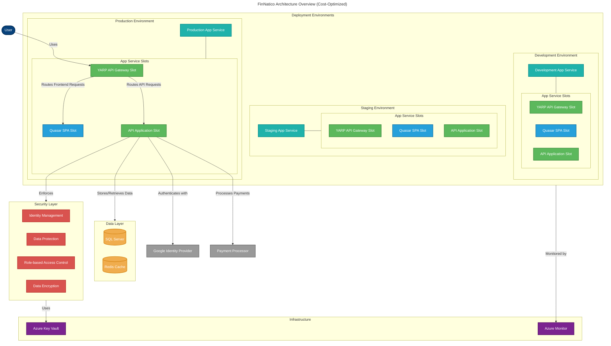
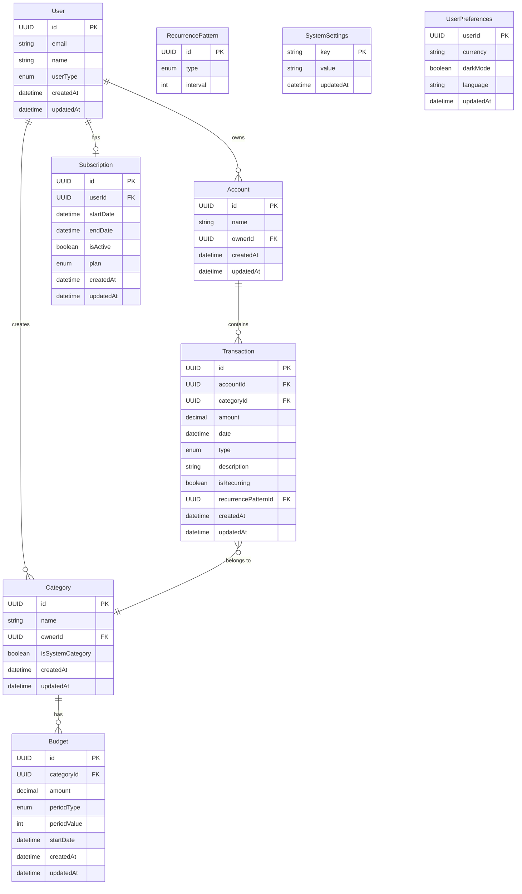
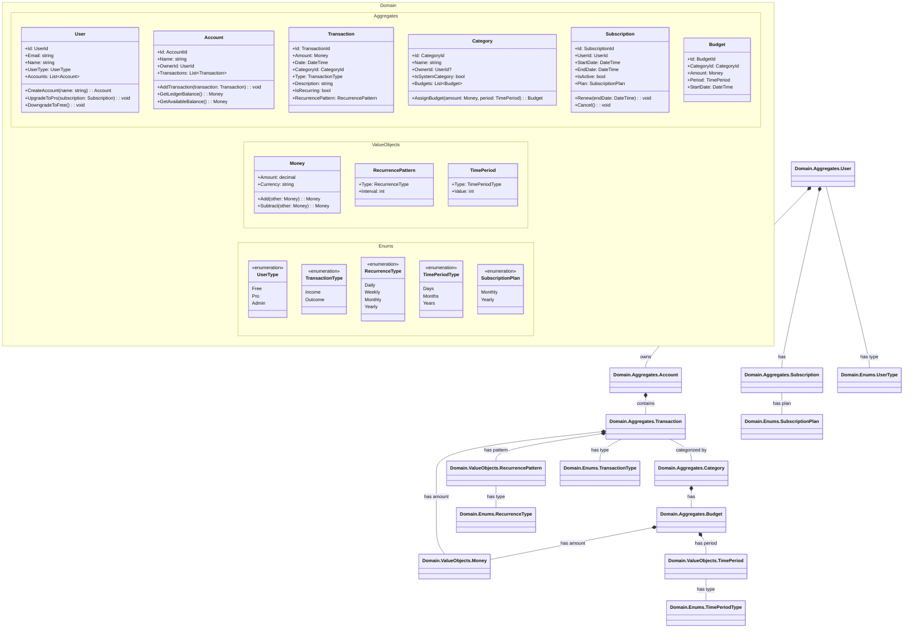

## Índice

0. [Ficha del proyecto](#0-ficha-del-proyecto)
1. [Descripción general del producto](#1-descripción-general-del-producto)
2. [Arquitectura del sistema](#2-arquitectura-del-sistema)
3. [Modelo de datos](#3-modelo-de-datos)
4. [Especificación de la API](#4-especificación-de-la-api)
5. [Historias de usuario](#5-historias-de-usuario)
6. [Tickets de trabajo](#6-tickets-de-trabajo)
7. [Pull requests](#7-pull-requests)

---

## 0. Ficha del proyecto

### **0.1. Tu nombre completo:**
Ignasi Conesa Cortadella
### **0.2. Nombre del proyecto:**
FinNatico: Your Personal Finance Command Center
### **0.3. Descripción breve del proyecto:**
Take control of your financial life with FinNatico, the comprehensive personal finance management solution designed to bring clarity to your spending and savings.
FinNatico empowers you to track every aspect of your finances in one intuitive platform. Create personalized expense categories or choose from our smart suggestions including shopping, dining, education, and fitness. Set customized budgets for each category and receive insights on your spending patterns.
Manage multiple accounts seamlessly with our banking-grade interface. Track deposits, expenses, and instantly transfer funds between accounts without leaving the application. Our dashboard provides real-time visualization of your financial health, helping you make informed decisions about your money.
Whether you're saving for a goal, reducing debt, or simply wanting better financial organization, FinNatico delivers the tools you need for financial success.
### **0.4. URL del proyecto:**
 
> Puede ser pública o privada, en cuyo caso deberás compartir los accesos de manera segura. Puedes enviarlos a [alvaro@lidr.co](mailto:alvaro@lidr.co) usando algún servicio como [onetimesecret](https://onetimesecret.com/).

### 0.5. URL o archivo comprimido del repositorio

> Puedes tenerlo alojado en público o en privado, en cuyo caso deberás compartir los accesos de manera segura. Puedes enviarlos a [alvaro@lidr.co](mailto:alvaro@lidr.co) usando algún servicio como [onetimesecret](https://onetimesecret.com/). También puedes compartir por correo un archivo zip con el contenido


---

## 1. Descripción general del producto

> Describe en detalle los siguientes aspectos del producto:

### **1.1. Objetivo:**

FinNatico is a comprehensive personal finance application designed for individuals and families seeking to manage their budgets effectively. The application allows users to track expenses, set category budgets, and monitor financial health through intuitive dashboards without connecting to banking institutions. Its main value lies in complete data anonymization—users manually record transactions rather than linking sensitive bank accounts, ensuring privacy while maintaining full control over their financial information. FinNatico serves both casual users with basic budgeting needs and financial enthusiasts requiring detailed tracking through its tiered subscription model.

### **1.2. Características y funcionalidades principales:**

Sign up with Google account
Subscribe to Pro plan for premium features
Create and manage financial accounts
Set up recurring income and expense transactions
Record manual income and expense movements
Assign categories to transactions
Create budgets for specific categories and time periods
View account balances (available and ledger)
Access financial dashboard with visual reports and budget tracking

### **1.3. Diseño y experiencia de usuario:**

> Proporciona imágenes y/o videotutorial mostrando la experiencia del usuario desde que aterriza en la aplicación, pasando por todas las funcionalidades principales.

### **1.4. Instrucciones de instalación:**
> Documenta de manera precisa las instrucciones para instalar y poner en marcha el proyecto en local (librerías, backend, frontend, servidor, base de datos, migraciones y semillas de datos, etc.)

---

## 2. Arquitectura del Sistema

### **2.1. Diagrama de arquitectura:**

```mermaid
%%{init: {'theme': 'neutral', 'flowchart': {'useMaxWidth': false}}}%%

%% Level 1: System Context Diagram
flowchart TB
    %% Title for Level 1
    subgraph Level1["System Context"]
        %% Actors and External Systems
        user["Person: User
        A person who manages their personal finances"]
        googleIdentity["External System: Google Identity
        External identity provider"]
        paymentProcessor["External System: Payment Processor
        Handles subscription payments"]
        
        %% Main System
        financialSystem["System: FinNatico
        Allows users to manage accounts, track expenses, and set budgets"]
        
        %% Relationships
        user -->|"Uses (HTTPS)"| financialSystem
        financialSystem -->|"Authenticates via OAuth2"| googleIdentity
        financialSystem -->|"Processes payments via API"| paymentProcessor
    end

    %% Level 2: Container Diagram (Cost-Optimized)
    subgraph Level2["Container Diagram (Cost-Optimized)"]
        %% External actors and systems for Level 2
        user2["Person: User
        A person who manages personal finances"]
        googleIdentity2["External System: Google Identity
        External identity provider"]
        paymentProcessor2["External System: Payment Processor
        Handles subscription payments"]
        
        %% System containers
        subgraph financialSystem2["System: FinNatico"]
            subgraph environments["Deployment Environments"]
                subgraph productionEnv["Production Environment"]
                    prodAppService["Container: Production App Service
                    Hosts all production components"]
                    
                    subgraph prodSlots["App Service Slots"]
                        prodApiGatewaySlot["Slot: YARP API Gateway
                        Routes and secures requests"]
                        prodSpaSlot["Slot: Quasar SPA
                        Vue.js, Quasar Framework"]
                        prodApiSlot["Slot: API Application
                        .NET Core, ASP.NET Core"]
                    end
                end
                
                subgraph stagingEnv["Staging Environment"]
                    stageAppService["Container: Staging App Service
                    Hosts all staging components"]
                    
                    subgraph stageSlots["App Service Slots"]
                        stageApiGatewaySlot["Slot: YARP API Gateway
                        Routes and secures requests"]
                        stageSpaSlot["Slot: Quasar SPA
                        Vue.js, Quasar Framework"]
                        stageApiSlot["Slot: API Application
                        .NET Core, ASP.NET Core"]
                    end
                end
                
                subgraph devEnv["Development Environment"]
                    devAppService["Container: Development App Service
                    Hosts all development components"]
                    
                    subgraph devSlots["App Service Slots"]
                        devApiGatewaySlot["Slot: YARP API Gateway
                        Routes and secures requests"]
                        devSpaSlot["Slot: Quasar SPA
                        Vue.js, Quasar Framework"]
                        devApiSlot["Slot: API Application
                        .NET Core, ASP.NET Core"]
                    end
                end
            end
            
            database["Container: Database
            SQL Server
            Stores user accounts, transactions, categories, and subscriptions"]
            cache["Container: Cache
            Redis
            Provides performance optimization"]
            keyVault["Container: Key Vault
            Azure Key Vault
            Secures sensitive configuration and secrets"]
            monitoring["Container: Monitoring
            Azure Monitor
            Provides application insights and logging"]
        end
        
        %% Relationships
        user2 -->|"Uses (HTTPS)"| prodApiGatewaySlot
        prodApiGatewaySlot -->|"Routes to"| prodSpaSlot
        prodApiGatewaySlot -->|"Routes to"| prodApiSlot
        prodApiSlot -->|"Reads/writes using EF Core"| database
        prodApiSlot -->|"Caches frequently accessed data"| cache
        prodApiSlot -->|"Retrieves secrets from"| keyVault
        environments -->|"Logs telemetry to"| monitoring
        prodApiSlot -->|"Authenticates via OAuth2"| googleIdentity2
        prodApiSlot -->|"Processes payments via API"| paymentProcessor2
    end

    %% Level 3: Component Diagram - API Application
    subgraph Level3["Component Diagram - API Application"]
        %% External components for Level 3
        apiGateway3["Slot: YARP API Gateway
        Routes and secures requests"]
        spaApplication3["Slot: Quasar SPA
        Vue.js, Quasar Framework"]
        database3["Container: Database
        SQL Server"]
        cache3["Container: Cache
        Redis"]
        googleIdentity3["External System: Google Identity"]
        paymentProcessor3["External System: Payment Processor"]
        
        %% API Application components
        subgraph apiApplication3["Slot: API Application"]
            %% Controllers
            userController["Component: User Controller
            ASP.NET Core API Controller
            Handles user operations and authentication"]
            accountController["Component: Account Controller
            ASP.NET Core API Controller
            Handles account management"]
            transactionController["Component: Transaction Controller
            ASP.NET Core API Controller
            Handles transaction operations"]
            categoryController["Component: Category Controller
            ASP.NET Core API Controller
            Handles category and budget management"]
            subscriptionController["Component: Subscription Controller
            ASP.NET Core API Controller
            Handles Pro subscription management"]
            
            %% Service Layers
            applicationServices["Component: Application Services
            C# Classes
            Implements application logic, coordinates domain objects"]
            
            subgraph securityServices["Component: Security Services"]
                authService["Identity Management"]
                dataProtection["Data Protection"]
                rbacService["Role-based Access Control"]
                encryptionService["Data Encryption"]
            end
            
            domainModel["Component: Domain Model
            C# Classes
            Implements domain entities, value objects, and business logic"]
            repositories["Component: Repositories
            C# Classes
            Provides data access abstraction"]
            infrastructure["Component: Infrastructure
            C# Classes
            Provides implementation for external services"]
        end
        
        %% Relationships - Internal
        apiGateway3 -->|"Routes API requests to"| apiApplication3
        apiGateway3 -->|"Routes frontend requests to"| spaApplication3
        
        userController --> applicationServices
        accountController --> applicationServices
        transactionController --> applicationServices
        categoryController --> applicationServices
        subscriptionController --> applicationServices
        
        applicationServices --> securityServices
        applicationServices --> domainModel
        applicationServices --> repositories
        repositories --> database3
        repositories --> cache3
        repositories --> domainModel
        infrastructure --> googleIdentity3
        infrastructure --> paymentProcessor3
        applicationServices --> infrastructure
    end

    %% Connect the levels for better visualization
    Level1 --- Level2
    Level2 --- Level3
    
    %% Styling
    classDef person fill:#08427B,color:#fff,stroke:#052E56
    classDef system fill:#1168BD,color:#fff,stroke:#0B4884
    classDef container fill:#438DD5,color:#fff,stroke:#2E6295
    classDef slot fill:#9370DB,color:#fff,stroke:#7B68EE
    classDef component fill:#85BBF0,color:#000,stroke:#5D82A8
    classDef database fill:#438DD5,color:#fff,stroke:#2E6295
    classDef securityComponent fill:#D9534F,color:#fff,stroke:#B82E29
    classDef external fill:#999999,color:#fff,stroke:#6B6B6B
    classDef environment fill:#20B2AA,color:#fff,stroke:#008B8B
    
    class user,user2 person
    class googleIdentity,googleIdentity2,googleIdentity3,paymentProcessor,paymentProcessor2,paymentProcessor3 external
    class financialSystem,financialSystem2 system
    class productionEnv,stagingEnv,devEnv environment
    class prodAppService,stageAppService,devAppService,database,cache,keyVault,monitoring container
    class prodApiGatewaySlot,prodSpaSlot,prodApiSlot,stageApiGatewaySlot,stageSpaSlot,stageApiSlot,devApiGatewaySlot,devSpaSlot,devApiSlot,apiGateway3,spaApplication3 slot
    class database3,cache3 database
    class userController,accountController,transactionController,categoryController,subscriptionController,applicationServices,domainModel,repositories,infrastructure component
    class securityServices,authService,dataProtection,rbacService,encryptionService securityComponent
```




### **2.2. Descripción de componentes principales:**

Frontend Components
| Component | Technology | Responsibility |
|-----------|------------|----------------|
| Quasar SPA | Vue.js, Quasar Framework, TypeScript | Provides the main web user interface for FinNatico. Handles UI rendering, client-side validation, responsive design, and user interactions. Implements the presentation layer using component-based architecture. |

API Gateway Components
| Component | Technology | Responsibility |
|-----------|------------|----------------|
| YARP API Gateway | .NET Core, YARP (Yet Another Reverse Proxy) | Routes and secures all incoming requests to appropriate backend services. Provides load balancing, request aggregation, and serves as the single entry point for all client applications. Handles cross-cutting concerns like rate limiting, CORS, and authentication validation. |

Backend Components
| Component | Technology | Responsibility |
|-----------|------------|----------------|
| API Application | .NET Core, ASP.NET Core, C# | Implements the core business logic and provides RESTful APIs for the frontend. Processes user requests, orchestrates domain operations, and manages data access. |
| User Controller | ASP.NET Core API Controllers | Handles user registration, authentication, profile management, and authorization. Integrates with Google Identity for authentication. |
| Account Controller | ASP.NET Core API Controllers | Manages financial accounts, including creation, updates, and querying of account information and balances. |
| Transaction Controller | ASP.NET Core API Controllers | Processes financial transactions, including adding income/expenses, recurring transactions, and transaction history. |
| Category Controller | ASP.NET Core API Controllers | Handles expense categories, including system-defined and user-defined categories. |
| Subscription Controller | ASP.NET Core API Controllers | Manages premium subscriptions, including upgrades, renewals, and cancellations. Integrates with payment processor. |

Service Layers
| Component | Technology | Responsibility |
|-----------|------------|----------------|
| Application Services | C# | Implements application logic and use cases. Coordinates domain objects and provides a facade for the domain layer. |
| Domain Model | C# (Domain-Driven Design) | Contains business entities, value objects, and domain logic. Implements the core financial rules and ensures data integrity. |
| Repositories | C# with Entity Framework Core | Provides data access abstraction and persistence operations. Implements the repository pattern to decouple domain from data access. |
| Infrastructure | C# | Implements infrastructure concerns like external service integrations, email sending, and file storage. |

Security Components
| Component | Technology | Responsibility |
|-----------|------------|----------------|
| Identity Management | ASP.NET Core Identity, OAuth/OpenID Connect | Handles user authentication, authorization, and integration with Google Identity. |
| Data Protection | .NET Data Protection API | Secures sensitive data at rest and in transit. |
| Role-based Access Control | ASP.NET Core Authorization | Implements permission-based security for different user types (Free, Pro, Admin). |
| Data Encryption | .NET Cryptography, Azure Key Vault | Secures sensitive financial information through encryption. |

Data Components
| Component | Technology | Responsibility |
|-----------|------------|----------------|
| Database | SQL Server | Stores all application data including users, accounts, transactions, categories, and budgets. |
| Cache | Redis | Improves performance by caching frequently accessed data and reducing database load. |

Deployment Environment Components
| Component | Technology | Responsibility |
|-----------|------------|----------------|
| Production Environment | Azure App Service | Hosts the live system used by end users with highest reliability and performance standards. |
| Staging Environment | Azure App Service | Mirrors production for final testing before deployment, enabling swap deployments with minimal downtime. |
| Development Environment | Azure App Service | Provides an isolated environment for testing new features and integrations during development. |

### **2.3. Descripción de alto nivel del proyecto y estructura de ficheros**

FinNatico/
│
├── src/
│   ├── Frontend/
│   │   ├── FinNatico.WebApp/               # Quasar SPA Application
│   │   │   ├── src/
│   │   │   │   ├── assets/                 # Static resources
│   │   │   │   ├── boot/                   # App initialization
│   │   │   │   ├── components/             # Reusable Vue components
│   │   │   │   ├── composables/            # Vue composition API functions
│   │   │   │   ├── css/                    # Global styles
│   │   │   │   ├── i18n/                   # Internationalization files
│   │   │   │   ├── layouts/                # Page layouts
│   │   │   │   ├── pages/                  # Application pages
│   │   │   │   ├── router/                 # Vue Router configuration
│   │   │   │   ├── services/               # API services
│   │   │   │   ├── stores/                 # Pinia state management
│   │   │   │   ├── types/                  # TypeScript type definitions
│   │   │   │   └── App.vue                 # Root component
│   │   │   ├── public/                     # Public assets
│   │   │   ├── tests/                      # Frontend tests
│   │   │   │   ├── unit/                   # Unit tests
│   │   │   │   └── e2e/                    # End-to-end tests
│   │   │   └── quasar.config.js            # Quasar configuration
│   │   │
│   │   └── FinNatico.Mobile/              # Mobile app configuration (Capacitor)
│   │
│   ├── Backend/
│   │   ├── FinNatico.ApiGateway/          # YARP API Gateway
│   │   │
│   │   ├── FinNatico.Api/                 # API Layer
│   │   │   ├── Controllers/               # API Controllers
│   │   │   ├── Filters/                   # Action filters
│   │   │   ├── Middleware/                # Custom middleware
│   │   │   └── Program.cs                 # App entry point
│   │   │
│   │   ├── FinNatico.Application/         # Application Layer
│   │   │   ├── Commands/                  # Command handlers
│   │   │   │   ├── Accounts/
│   │   │   │   ├── Categories/
│   │   │   │   ├── Transactions/
│   │   │   │   ├── Users/
│   │   │   │   └── Subscriptions/
│   │   │   ├── Queries/                   # Query handlers
│   │   │   ├── DTOs/                      # Data Transfer Objects
│   │   │   ├── Interfaces/                # Service interfaces
│   │   │   ├── Services/                  # Application services
│   │   │   └── Validators/                # Input validation
│   │   │
│   │   ├── FinNatico.Domain/              # Domain Layer
│   │   │   ├── Aggregates/                # Domain aggregates
│   │   │   │   ├── User/
│   │   │   │   ├── Account/
│   │   │   │   ├── Transaction/
│   │   │   │   ├── Category/
│   │   │   │   ├── Budget/
│   │   │   │   └── Subscription/
│   │   │   ├── Enums/                     # Domain enumerations
│   │   │   ├── Events/                    # Domain events
│   │   │   ├── Exceptions/                # Domain exceptions
│   │   │   ├── Services/                  # Domain services
│   │   │   └── ValueObjects/              # Value objects
│   │   │
│   │   ├── FinNatico.Infrastructure/      # Infrastructure Layer
│   │   │   ├── Data/                      # Data access
│   │   │   │   ├── Context/               # EF Core context
│   │   │   │   ├── Migrations/            # EF Core migrations
│   │   │   │   ├── Repositories/          # Repository implementations
│   │   │   │   └── Configurations/        # Entity configurations
│   │   │   ├── Identity/                  # Authentication/Authorization
│   │   │   ├── Messaging/                 # Event handling
│   │   │   ├── Services/                  # External service integrations
│   │   │   └── Cache/                     # Redis caching implementation
│   │   │
│   │   └── FinNatico.Shared/              # Shared components
│   │       ├── Constants/
│   │       ├── Extensions/
│   │       └── Utilities/
│   │
│   └── Deployment/
│       ├── AppService/                    # Azure App Service configuration
│       │   ├── Development/
│       │   ├── Staging/
│       │   └── Production/
│       ├── Database/                      # Database scripts and migrations
│       └── Monitoring/                    # Monitoring and logging setup
│
├── tests/
│   ├── FinNatico.UnitTests/               # Unit tests
│   │   ├── Application/
│   │   ├── Domain/
│   │   └── Infrastructure/
│   │
│   ├── FinNatico.IntegrationTests/        # Integration tests
│   │
│   └── FinNatico.FunctionalTests/         # Functional/API tests
│
├── docs/
│   ├── Architecture/                     # Architecture documents and diagrams
│   │   ├── C4_flowchart.mmd
│   │   ├── C4_classDiagram.mmd
│   │   └── architecture_overview.md
│   ├── DomainModel/                      # Domain model documentation
│   ├── API/                              # API documentation
│   └── UserGuides/                       # End-user documentation
│
├── .gitignore
├── README.md
└── FinNatico.sln                         # Solution file


### **2.4. Infraestructura y despliegue**

# FinNatico Infrastructure Requirements

## Core Infrastructure Components

### Azure Resources Required

#### Resource Group
- **Purpose**: Logical container for all Azure resources
- **Naming Convention**: `finnatico-{environment}-rg`

#### App Service Plan
- **Purpose**: Hosts the App Services for all environments
- **Specifications**:
  - **Tier**: Standard (S1) minimum for development, Premium (P2V2) recommended for production
  - **Operating System**: Windows (needed for .NET)
  - **Naming Convention**: `finnatico-{environment}-plan`

#### App Services
- **Purpose**: Host the application components
- **Configuration**:
  - One App Service per environment (Development, Staging, Production)
  - Each with 3 deployment slots:
    - YARP API Gateway Slot
    - Quasar SPA Slot
    - .NET API Application Slot
  - Settings for CORS, authentication, and environment variables
  - **Naming Convention**: `finnatico-{environment}` with slots

#### SQL Server and Database
- **Purpose**: Store application data
- **Configuration**:
  - SQL Server: One instance
  - SQL Databases: One per environment (Dev/Test can share with different schemas)
  - Firewall rules to allow App Service access
  - **Naming Convention**: 
    - Server: `finnatico-{environment}-sqlserver`
    - Database: `finnatico-{environment}-db`

#### Redis Cache
- **Purpose**: Performance optimization and distributed caching
- **Specifications**:
  - Standard tier minimum (C0 for dev, C1 for production)
  - Non-SSL port disabled
  - TLS 1.2 minimum
  - **Naming Convention**: `finnatico-{environment}-redis`

#### Azure Key Vault
- **Purpose**: Secure secret management
- **Configuration**:
  - Store connection strings, API keys, and certificates
  - Access policies for App Services
  - **Naming Convention**: `finnatico-{environment}-kv`

#### Application Insights
- **Purpose**: Application monitoring and telemetry
- **Configuration**:
  - Connected to each App Service
  - Linked to Log Analytics workspace
  - **Naming Convention**: `finnatico-{environment}-insights`

#### Storage Account
- **Purpose**: Store logs and application backups
- **Configuration**:
  - Standard LRS (locally redundant) for dev, GRS (geo-redundant) for production
  - Secure transfer required
  - **Naming Convention**: `finnatico{environment}storage`

### Security and Network Components

#### Virtual Network (Optional but Recommended)
- **Purpose**: Secure communication between services
- **Configuration**:
  - Subnets for App Services and databases
  - Service endpoints for SQL and Redis
  - **Naming Convention**: `finnatico-{environment}-vnet`

#### Private Endpoints (Recommended for Production)
- **Purpose**: Secure connectivity to PaaS services
- **Configuration**:
  - Private endpoints for Key Vault and SQL Server
  - **Naming Convention**: `finnatico-{environment}-{service}-pe`

#### Front Door / CDN (Recommended for Production)
- **Purpose**: Global distribution and WAF protection
- **Configuration**:
  - WAF policies
  - Custom domains
  - SSL certificates
  - **Naming Convention**: `finnatico-{environment}-frontdoor`

#### Azure AD Integration
- **Purpose**: Service authentication and authorization
- **Configuration**:
  - App registrations
  - Managed identities for services
  - RBAC role assignments

## Environment-Specific Requirements

### Development Environment
- Minimal resources with cost optimization
- Standard tier App Service Plan (S1)
- Basic tier SQL Database (Basic)
- Standard tier Redis Cache (C0)

### Staging Environment
- Similar to production for accurate testing
- Standard tier App Service Plan (S1)
- Standard tier SQL Database (S1)
- Standard tier Redis Cache (C1)

### Production Environment
- Optimized for performance and reliability
- Premium tier App Service Plan (P2V2)
- Standard tier SQL Database (S2)
- Standard tier Redis Cache (C1)
- Geo-redundant storage
- Front Door with WAF

## Terraform Deployment Strategy

### Module Structure

Terraform Implementation

Below is a detailed Terraform implementation to deploy the FinNatico infrastructure:

terraform/
├── environments/
│   ├── dev/
│   │   ├── main.tf
│   │   ├── variables.tf
│   │   └── terraform.tfvars
│   ├── staging/
│   │   ├── main.tf
│   │   ├── variables.tf
│   │   └── terraform.tfvars
│   └── prod/
│       ├── main.tf
│       ├── variables.tf
│       └── terraform.tfvars
├── modules/
│   ├── app_service/
│   │   ├── main.tf
│   │   ├── variables.tf
│   │   └── outputs.tf
│   ├── database/
│   │   ├── main.tf
│   │   ├── variables.tf
│   │   └── outputs.tf
│   ├── redis/
│   │   ├── main.tf
│   │   ├── variables.tf
│   │   └── outputs.tf
│   ├── key_vault/
│   │   ├── main.tf
│   │   ├── variables.tf
│   │   └── outputs.tf
│   ├── monitoring/
│   │   ├── main.tf
│   │   ├── variables.tf
│   │   └── outputs.tf
│   └── networking/
│       ├── main.tf
│       ├── variables.tf
│       └── outputs.tf
├── global.tf
└── README.md


### Deployment Process
1. Initialize Terraform backend storage
2. Apply base infrastructure (Resource groups, networking)
3. Deploy secure resources (Key Vault, etc.)
4. Deploy application resources (App Services, databases)
5. Configure monitoring and alerts
6. Apply environment-specific customizations

### State Management
- Remote state in Azure Storage Account
- State locking with Azure Blob
- Separate state files per environment

### CI/CD Integration
- Terraform validation in build pipelines
- Plan generation and review in pull requests
- Apply on merge to protected branches
- Post-deployment validation tests

### **2.5. Seguridad**

# FinNatico Security Practices

## Authentication & Identity Management

### OAuth 2.0 with Google Identity
- Secure authentication through Google's OAuth 2.0 implementation
- No password storage within FinNatico
- User identity verification handled by trusted provider

**Example implementation:**
```csharp
// Program.cs
builder.Services.AddAuthentication(options =>
{
    options.DefaultAuthenticateScheme = JwtBearerDefaults.AuthenticationScheme;
    options.DefaultChallengeScheme = JwtBearerDefaults.AuthenticationScheme;
})
.AddJwtBearer(options => {
    // JWT validation parameters
})
.AddGoogle(options =>
{
    options.ClientId = builder.Configuration["Authentication:Google:ClientId"];
    options.ClientSecret = builder.Configuration["Authentication:Google:ClientSecret"];
});
```

### JWT Token Security
- Short-lived access tokens (15 minutes)
- Token validation with proper issuer, audience, and signing key verification
- Refresh token rotation for enhanced security

**Example validation:**
```csharp
options.TokenValidationParameters = new TokenValidationParameters
{
    ValidateIssuer = true,
    ValidateAudience = true,
    ValidateLifetime = true,
    ValidateIssuerSigningKey = true,
    ValidIssuer = builder.Configuration["Jwt:Issuer"],
    ValidAudience = builder.Configuration["Jwt:Audience"],
    IssuerSigningKey = new SymmetricSecurityKey(
        Encoding.UTF8.GetBytes(builder.Configuration["Jwt:Key"])),
    ClockSkew = TimeSpan.Zero // Reduce default 5 min clock skew
};
```

## Cross-Site Scripting (XSS) Prevention

### Content Security Policy
- Strict CSP implementation with nonce-based script validation
- Restriction of inline scripts and styles
- Control over allowed content sources

**Example CSP header:**
```csharp
app.Use(async (context, next) =>
{
    var nonce = Convert.ToBase64String(RandomNumberGenerator.GetBytes(16));
    context.Items["csp-nonce"] = nonce;
    
    context.Response.Headers.Add(
        "Content-Security-Policy",
        $"default-src 'self'; script-src 'self' 'nonce-{nonce}' https://apis.google.com; " +
        "style-src 'self' https://fonts.googleapis.com; " +
        "font-src 'self' https://fonts.gstatic.com; " +
        "img-src 'self' data: https://secure.example.com; " +
        "frame-ancestors 'none'; form-action 'self';");
    
    await next();
});
```

### Vue.js XSS Protection
- Automatic HTML escaping in Vue templates
- Strict avoidance of v-html with untrusted content
- Use of DOMPurify for necessary HTML rendering

**Example sanitization:**
```javascript
import DOMPurify from 'dompurify';

export default {
  props: ['userContent'],
  computed: {
    sanitizedHtml() {
      return this.userContent ? DOMPurify.sanitize(this.userContent) : '';
    }
  },
  template: `<div v-if="userContent" v-html="sanitizedHtml"></div>`
}
```

## Secure API Communication

### API Gateway Security
- YARP implementation for request routing and validation
- Rate limiting to prevent brute force and DoS attacks
- Request/response inspection for security threats

**Example rate limiting:**
```csharp
builder.Services.AddRateLimiter(options =>
{
    options.GlobalLimiter = PartitionedRateLimiter.Create<HttpContext, string>(ctx =>
    {
        var clientIp = ctx.Connection.RemoteIpAddress?.ToString() ?? "unknown";
        return RateLimitPartition.GetTokenBucketLimiter(clientIp, 
            _ => new TokenBucketRateLimiterOptions
            {
                TokenLimit = 100,
                ReplenishmentPeriod = TimeSpan.FromMinutes(1),
                TokensPerPeriod = 100
            });
    });
});
```

### CORS Protection
- Explicit allowlist of origins (no wildcards in production)
- Restriction of allowed methods and headers
- Careful credential handling for cross-origin requests

**Example CORS policy:**
```csharp
builder.Services.AddCors(options =>
{
    options.AddPolicy("ProductionPolicy", policy =>
    {
        policy.WithOrigins("https://finnatico.com")
              .WithMethods("GET", "POST", "PUT", "DELETE")
              .WithHeaders("Authorization", "Content-Type")
              .AllowCredentials();
    });
});
```

## Data Protection

### Sensitive Data Encryption
- ASP.NET Core Data Protection for secure data storage
- Field-level encryption for financial information
- Azure Key Vault integration for key management

**Example encryption:**
```csharp
public class SensitiveDataProtector
{
    private readonly IDataProtector _protector;
    
    public SensitiveDataProtector(IDataProtectionProvider provider)
    {
        _protector = provider.CreateProtector("FinNatico.SensitiveData.v1");
    }
    
    public string Protect(string data) => _protector.Protect(data);
    
    public string Unprotect(string protectedData) => _protector.Unprotect(protectedData);
}
```

### SQL Injection Prevention
- Entity Framework Core with parameterized queries
- Use of strong typing for all database interactions
- Input validation before database operations

**Example safe query:**
```csharp
// Safe: Using parameterized queries with EF Core
public async Task<Transaction> GetTransactionById(int id)
{
    return await _context.Transactions
        .Include(t => t.Category)
        .FirstOrDefaultAsync(t => t.Id == id);
}
```

## Infrastructure Security

### Azure Key Vault Integration
- Secure storage of all application secrets
- Managed identities for service authentication
- No hard-coded secrets in configuration or code

**Example Key Vault usage:**
```csharp
// Program.cs
builder.Configuration.AddAzureKeyVault(
    new Uri($"https://{builder.Configuration["KeyVault:VaultName"]}.vault.azure.net/"),
    new DefaultAzureCredential());

// Accessing secrets
public class PaymentService
{
    public PaymentService(IConfiguration configuration)
    {
        _apiKey = configuration["PaymentProvider:ApiKey"];
    }
}
```

### Deployment Slot Isolation
- Separate deployment slots for different application components
- Slot-specific configurations and settings
- Controlled swapping for zero-downtime deployments

## Monitoring and Incident Response

### Application Insights Integration
- Real-time monitoring of application health and performance
- Security event logging with appropriate detail
- Anomaly detection for unusual access patterns

**Example logging:**
```csharp
public class SecurityAuditMiddleware
{
    private readonly RequestDelegate _next;
    private readonly ILogger<SecurityAuditMiddleware> _logger;
    
    public async Task InvokeAsync(HttpContext context)
    {
        // Log authentication events
        if (context.Request.Path.StartsWithSegments("/api/auth"))
        {
            _logger.LogInformation(
                "Authentication attempt from {IpAddress}", 
                context.Connection.RemoteIpAddress);
        }
        
        await _next(context);
    }
}
```

### Alert Configuration
- Failed login attempt thresholds
- Unusual API usage patterns
- Potential security breach detection

## Client-Side Storage Security

### Secure Storage Practices
- No sensitive data in localStorage or sessionStorage
- Minimal use of cookies with secure configuration
- Encryption of any required client-side stored data

**Example secure storage:**
```typescript
// Simple client-side secure storage
const secureStorage = {
  getEncryptionKey(): string {
    // Key derivation from application-specific values
    return CryptoJS.SHA256(navigator.userAgent + location.origin).toString();
  },
  
  setItem(key: string, value: any): void {
    const encrypted = CryptoJS.AES.encrypt(
      JSON.stringify(value),
      this.getEncryptionKey()
    ).toString();
    sessionStorage.setItem(key, encrypted);
  },
  
  getItem(key: string): any {
    // Decrypt and return stored value
  }
};
```

## Mobile Security (PWA)

### Progressive Web App Security
- HTTPS-only service worker registration
- Careful permission management
- Secure offline data handling

**Example manifest security:**
```json
{
  "name": "FinNatico",
  "short_name": "FinNatico",
  "start_url": "/",
  "display": "standalone",
  "background_color": "#ffffff",
  "theme_color": "#4A90E2",
  "icons": [/* Icons configuration */],
  "permissions": ["notifications"],
  "related_applications": []
}
```


### **2.6. Tests**

# FinNatico Test Cases

This document outlines the key test cases that should be developed for the FinNatico application, organized by domain area and following TDD best practices.

## Authentication Tests

### Sign Up Tests
- `SignUp_WithValidGoogleAccount_CreatesUserAsFreeTier`
- `SignUp_WithExistingUser_ReturnsExistingUserData`
- `SignUp_WithInvalidGoogleToken_ReturnsAuthenticationError`

## Subscription Management Tests

### Pro Subscription Tests
- `BecomePro_WithValidPaymentInfo_UpgradesUserToProTier`
- `BecomePro_WithInvalidPaymentInfo_ReturnsPaymentError`
- `BecomePro_WhenAlreadyPro_ReturnsAlreadySubscribedError`

### Subscription Renewal Tests
- `RenewSubscription_WithValidPayment_ExtendsSubscriptionPeriod`
- `RenewSubscription_WithFailedPayment_ReturnsBillingError`
- `RenewSubscription_ForCanceledSubscription_ReturnsSubscriptionError`

### Subscription Cancellation Tests
- `CancelSubscription_ForActiveSubscription_CancelsAndDowngradesToFree`
- `CancelSubscription_WithMultipleAccounts_DisablesAdditionalAccountsAndDowngrades`
- `CancelSubscription_ForAlreadyCanceledSubscription_ReturnsAlreadyCanceledError`

## Account Management Tests

### Account Creation Tests
- `CreateAccount_AsProUser_CreatesNewAccount`
- `CreateAccount_AsProUserWithMultipleExistingAccounts_CreatesAdditionalAccount`
- `CreateAccount_AsFreeUserWithNoAccount_CreatesFirstAccount`
- `CreateAccount_AsFreeUserWithExistingAccount_ReturnsTierLimitError`

### Transaction Management Tests
- `AddRecurringIncome_WithValidData_CreatesRecurringIncome`
- `AddRecurringIncome_WithNegativeAmount_ReturnsValidationError`
- `AddRecurringIncome_WithInvalidFrequency_ReturnsValidationError`

- `AddRecurringOutcome_WithValidData_CreatesRecurringOutcome`
- `AddRecurringOutcome_WithNegativeAmount_ReturnsValidationError`
- `AddRecurringOutcome_WithInvalidFrequency_ReturnsValidationError`

- `AddManualIncome_WithValidData_CreatesIncomeTransaction`
- `AddManualIncome_WithNoCategory_AssignsToDefaultCategory`
- `AddManualIncome_WithNegativeAmount_ReturnsValidationError`
- `AddManualIncome_WithFutureDate_CreatesScheduledTransaction`

- `AddManualOutcome_WithValidData_CreatesOutcomeTransaction`
- `AddManualOutcome_WithNoCategory_AssignsToDefaultCategory`
- `AddManualOutcome_WithNegativeAmount_ReturnsValidationError`
- `AddManualOutcome_WithInsufficientFunds_CreatesOverdraftWhenAllowed`

### Category & Budget Tests
- `CreateCategoryBudget_WithValidData_CreatesNewBudget`
- `CreateCategoryBudget_WithNegativeAmount_ReturnsValidationError`
- `CreateCategoryBudget_WithInvalidPeriod_ReturnsValidationError`
- `CreateCategoryBudget_ForNonExistentCategory_ReturnsNotFoundError`

## Balance & Dashboard Tests

### Balance Calculation Tests
- `GetLedgerBalance_WithMultipleTransactions_ReturnsCorrectBalance`
- `GetLedgerBalance_WithPendingTransactions_IncludesPendingTransactions`
- `GetAvailableBalance_WithPendingTransactions_ExcludesPendingOutflows`
- `GetAvailableBalance_WithOverdraft_ReturnsNegativeBalanceWithinLimit`

### Dashboard Display Tests
- `GetFinancialDashboard_WithMultipleAccounts_ReturnsAggregatedData`
- `GetFinancialDashboard_WithBudgets_ReturnsProgressPerCategory`
- `GetFinancialDashboard_WithRecurringTransactions_IncludesFutureProjections`
- `GetFinancialDashboard_WithNoData_ReturnsEmptyDashboard`

## Integration Tests

### Data Consistency Tests
- `TransactionCreation_UpdatesAccountBalance_AndReflectsInDashboard`
- `CategoryDeletion_ReassignsTransactions_ToDefaultCategory`
- `SubscriptionCancellation_DisablesAdditionalAccounts_ButPreservesData`

### API Authorization Tests
- `AccessProtectedEndpoint_WithValidToken_ReturnsSuccess`
- `AccessProtectedEndpoint_WithExpiredToken_ReturnsAuthError`
- `AccessProOnlyEndpoint_WithFreeUser_ReturnsForbidden`
- `AccessAdminEndpoint_WithProUser_ReturnsForbidden`

## Performance Tests

### Query Performance Tests
- `LargeTransactionHistory_LoadsWithinAcceptableTime`
- `DashboardGeneration_WithYearOfData_CompletesWithinThreshold`
- `RecurringTransactionProcessing_HandlesHighVolume_WithinTimeLimit`

## Security Tests

### Authentication Security Tests
- `InvalidToken_IsRejected_WithProperError`
- `ExpiredToken_CanBeRefreshed_WithValidRefreshToken`
- `DeletedUserToken_CannotAccess_ProtectedResources`

### Data Isolation Tests
- `UserA_CannotAccess_UserBData`
- `FreeUser_CannotAccess_ProOnlyFeatures`
- `UserTransaction_IsIsolated_FromOtherUserTransactions`

## Test Data Setup

### Test Fixtures
```csharp
public class TestDataFixture
{
    public User FreeUser { get; private set; }
    public User ProUser { get; private set; }
    public List<Account> Accounts { get; private set; }
    public List<Category> Categories { get; private set; }

    public TestDataFixture()
    {
        // Initialize test data
        FreeUser = CreateTestFreeUser();
        ProUser = CreateTestProUser();
        Accounts = CreateTestAccounts();
        Categories = CreateTestCategories();
    }

    // Test data creation methods...
}
```

### Test Data Builders
```csharp
public class TransactionBuilder
{
    private readonly Transaction _transaction = new Transaction();
    
    public TransactionBuilder WithAmount(decimal amount)
    {
        _transaction.Amount = new Money(amount, Currency.USD);
        return this;
    }
    
    public TransactionBuilder WithType(TransactionType type)
    {
        _transaction.Type = type;
        return this;
    }
    
    // Other builder methods...
    
    public Transaction Build() => _transaction;
}
```

---

## 3. Modelo de Datos

### **3.1. Diagrama del modelo de datos:**



### **3.2. Descripción de entidades principales:**



---

## 4. Especificación de la API
```yaml
openapi: 3.0.3
info:
  title: FinNatico API
  description: API for the FinNatico personal finance management application
  version: 1.0.0
paths:
  /api/transactions:
    post:
      summary: Create a new transaction
      description: Adds a new income or outcome transaction to a user account
      operationId: createTransaction
      security:
        - bearerAuth: []
      tags:
        - Transactions
      requestBody:
        required: true
        content:
          application/json:
            schema:
              $ref: '#/components/schemas/TransactionCreateRequest'
            example:
              accountId: "acc-123e4567-e89b-12d3-a456-426614174000"
              amount: 125.50
              type: "Outcome"
              date: "2023-06-15T14:30:00Z"
              description: "Grocery shopping"
              categoryId: "cat-123e4567-e89b-12d3-a456-426614174000"
              isRecurring: false
      responses:
        '201':
          description: Transaction created successfully
          content:
            application/json:
              schema:
                $ref: '#/components/schemas/TransactionResponse'
              example:
                id: "trx-123e4567-e89b-12d3-a456-426614174000"
                accountId: "acc-123e4567-e89b-12d3-a456-426614174000"
                amount: 125.50
                type: "Outcome"
                date: "2023-06-15T14:30:00Z"
                description: "Grocery shopping"
                categoryId: "cat-123e4567-e89b-12d3-a456-426614174000"
                categoryName: "Food & Groceries"
                isRecurring: false
                createdAt: "2023-06-15T14:30:00Z"
        '400':
          description: Invalid request data
        '401':
          description: Unauthorized
        '403':
          description: Forbidden - insufficient permissions
  
  /api/accounts/{accountId}/balance:
    get:
      summary: Get account balance
      description: Returns both ledger and available balances for a specific account
      operationId: getAccountBalance
      security:
        - bearerAuth: []
      tags:
        - Accounts
      parameters:
        - name: accountId
          in: path
          required: true
          schema:
            type: string
          description: ID of the account to get balance for
      responses:
        '200':
          description: Account balance information
          content:
            application/json:
              schema:
                $ref: '#/components/schemas/AccountBalanceResponse'
              example:
                accountId: "acc-123e4567-e89b-12d3-a456-426614174000"
                accountName: "Main Checking"
                ledgerBalance: 2540.75
                availableBalance: 2350.30
                currency: "USD"
                pendingTransactions: 2
                asOfDate: "2023-06-15T18:30:00Z"
        '401':
          description: Unauthorized
        '403':
          description: Forbidden - insufficient permissions
        '404':
          description: Account not found
  
  /api/categories/{categoryId}/budgets:
    post:
      summary: Create a budget for a category
      description: Assigns a budget amount to a category for a specific time period
      operationId: createCategoryBudget
      security:
        - bearerAuth: []
      tags:
        - Budgets
      parameters:
        - name: categoryId
          in: path
          required: true
          schema:
            type: string
          description: ID of the category to create a budget for
      requestBody:
        required: true
        content:
          application/json:
            schema:
              $ref: '#/components/schemas/BudgetCreateRequest'
            example:
              amount: 300.00
              periodType: "Monthly"
              periodValue: 1
              startDate: "2023-06-01T00:00:00Z"
      responses:
        '201':
          description: Budget created successfully
          content:
            application/json:
              schema:
                $ref: '#/components/schemas/BudgetResponse'
              example:
                id: "bdg-123e4567-e89b-12d3-a456-426614174000"
                categoryId: "cat-123e4567-e89b-12d3-a456-426614174000"
                categoryName: "Food & Groceries"
                amount: 300.00
                periodType: "Monthly"
                periodValue: 1
                startDate: "2023-06-01T00:00:00Z"
                endDate: "2023-06-30T23:59:59Z"
                currentSpending: 125.50
                remainingBudget: 174.50
                percentUsed: 41.83
        '400':
          description: Invalid request data
        '401':
          description: Unauthorized
        '403':
          description: Forbidden - insufficient permissions
        '404':
          description: Category not found

components:
  schemas:
    TransactionCreateRequest:
      type: object
      required:
        - accountId
        - amount
        - type
        - date
      properties:
        accountId:
          type: string
          description: ID of the account for the transaction
        amount:
          type: number
          format: double
          description: Amount of the transaction
        type:
          type: string
          enum: [Income, Outcome]
          description: Type of transaction
        date:
          type: string
          format: date-time
          description: Date and time of the transaction
        description:
          type: string
          description: Description of the transaction
        categoryId:
          type: string
          description: ID of the transaction category
        isRecurring:
          type: boolean
          description: Whether this is a recurring transaction
        recurrencePattern:
          type: object
          properties:
            type:
              type: string
              enum: [Daily, Weekly, Monthly, Yearly]
            interval:
              type: integer
              minimum: 1
              
    TransactionResponse:
      type: object
      properties:
        id:
          type: string
        accountId:
          type: string
        amount:
          type: number
          format: double
        type:
          type: string
          enum: [Income, Outcome]
        date:
          type: string
          format: date-time
        description:
          type: string
        categoryId:
          type: string
        categoryName:
          type: string
        isRecurring:
          type: boolean
        recurrencePattern:
          type: object
          properties:
            type:
              type: string
            interval:
              type: integer
        createdAt:
          type: string
          format: date-time
            
    AccountBalanceResponse:
      type: object
      properties:
        accountId:
          type: string
        accountName:
          type: string
        ledgerBalance:
          type: number
          format: double
        availableBalance:
          type: number
          format: double
        currency:
          type: string
        pendingTransactions:
          type: integer
        asOfDate:
          type: string
          format: date-time
          
    BudgetCreateRequest:
      type: object
      required:
        - amount
        - periodType
        - startDate
      properties:
        amount:
          type: number
          format: double
          description: Budget amount
        periodType:
          type: string
          enum: [Daily, Weekly, Monthly, Yearly]
          description: Type of budget period
        periodValue:
          type: integer
          minimum: 1
          default: 1
          description: Number of period units
        startDate:
          type: string
          format: date-time
          description: Start date of the budget period
          
    BudgetResponse:
      type: object
      properties:
        id:
          type: string
        categoryId:
          type: string
        categoryName:
          type: string
        amount:
          type: number
          format: double
        periodType:
          type: string
        periodValue:
          type: integer
        startDate:
          type: string
          format: date-time
        endDate:
          type: string
          format: date-time
        currentSpending:
          type: number
          format: double
        remainingBudget:
          type: number
          format: double
        percentUsed:
          type: number
          format: double
          
  securitySchemes:
    bearerAuth:
      type: http
      scheme: bearer
      bearerFormat: JWT
      description: JWT token obtained from authentication process
``` 
---

## 5. Historias de Usuario


**Historia de Usuario 1**
### Sign up
As an adult person I can click on a button to sign up with my Google account. Only basic data will be get from Google identity provider.
By default all users are Signed up as a Free Users.
**Historia de Usuario 2**
### Create an account
1. As a Pro User I can create an account with a name defined by me. I can create multiple accounts.
2. As a Free User I can create an account with a name defined by me. I can create only one account.
After account is created a suggestion to create an initial movement will be triggered.

**Historia de Usuario 3**
### Create manually a income movement
As a User I can select an account and add a income movement to it, to do that I can set manually the amount* , the date* and the category.

---

## 6. Tickets de Trabajo

> Documenta 3 de los tickets de trabajo principales del desarrollo, uno de backend, uno de frontend, y uno de bases de datos. Da todo el detalle requerido para desarrollar la tarea de inicio a fin teniendo en cuenta las buenas prácticas al respecto. 

**Ticket 1**
# Product Backlog Item: Sign Up Feature

## PBI-001: Implement Google Account Sign Up

### Title
Implement Google Account Sign Up Functionality

### Detailed Description
As an adult person, I need to be able to sign up for FinNatico using my Google account so that I can quickly create an account without having to create and remember another set of credentials.

The sign-up process should be straightforward with a clear button for Google authentication. Upon successful authentication with Google, the system should retrieve only the basic necessary information (name, email) from the Google identity provider. All users should be automatically assigned the Free User role upon initial registration.

The implementation should handle both new user registration and returning user recognition. The system should also ensure compliance with GDPR by minimizing data collection and providing clear information about data usage.

### Acceptance Criteria
1. A prominent "Sign Up with Google" button is displayed on the sign-up page
2. Clicking the button initiates the OAuth2 flow with Google
3. Only basic data (name, email) is retrieved from Google
4. New users are automatically assigned the "Free User" role
5. Returning users are recognized and redirected to their dashboard
6. Error handling for failed Google authentication is implemented
7. User consent for data usage is obtained during sign-up
8. GDPR compliance notice is displayed during the sign-up process
9. An automated welcome email is sent to new users
10. The system correctly distinguishes between new and returning users
11. The entire process works on desktop and mobile browsers

### Priority
High (Must have for MVP)

### Effort Estimation
8 story points (approximately 3-5 days of development work)

### Tags
- Authentication
- Google OAuth
- User Management
- GDPR
- Frontend
- Backend
- Security

### Links or References
- [UseCase Document](UseCases.md#sign-up)
- [OAuth 2.0 for Google Identity](https://developers.google.com/identity/protocols/oauth2)
- [GDPR Compliance Requirements](https://gdpr-info.eu/)
- [Design Mockup Link: Sign Up Screen](https://example.com/designs/signup)
- Related PBIs: 
  - PBI-002: Implement Free User Permissions
  - PBI-015: User Dashboard Initial View

### Dependencies
- Azure AD B2C Configuration must be completed
- API Gateway must be configured to handle authentication tokens
- User database schema must be finalized

### Technical Notes
- Implementation will use the Google Identity API
- JWT tokens will be used for maintaining authentication state
- User information will be stored in the SQL Server database with proper encryption
- No password storage is required as authentication is delegated to Google
**Ticket 2**
# Product Backlog Item: Account Creation

## PBI-002: Implement Account Creation Functionality

### Title
Implement Account Creation for Users

### Detailed Description
As a FinNatico user, I need to be able to create financial accounts in the system so that I can track my income, expenses, and manage my finances effectively.

The account creation functionality should handle the different permissions for Free and Pro users:
- Pro Users should be able to create multiple accounts (e.g., checking, savings, credit cards)
- Free Users should be limited to creating only one account

The account creation form should be simple and intuitive, requiring just a name for the account. After successful account creation, the system should suggest creating an initial transaction to help users get started with the platform.

### Acceptance Criteria
1. A clear "Create Account" button is accessible from the user dashboard
2. The account creation form includes a field for account name
3. Free Users can create only one account
4. Pro Users can create multiple accounts
5. The system prevents Free Users from creating additional accounts beyond their limit
6. Free Users are shown information about upgrading to Pro when attempting to create additional accounts
7. After successful account creation, a prompt to add an initial transaction appears
8. Each account shows a default zero balance until transactions are added
9. Account names must be unique per user
10. Account creation must be logged for audit purposes
11. The new account immediately appears in the user's account list after creation
12. The interface properly adapts to desktop and mobile viewports

### Priority
High (Must have for MVP)

### Effort Estimation
5 story points (approximately 2-3 days of development work)

### Tags
- Account Management
- User Management
- Subscription Features
- Frontend
- Backend
- Database

### Links or References
- [UseCase Document](UseCases.md#create-an-account)
- [Design Mockup Link: Account Creation Screen](https://example.com/designs/account-creation)
- [Account Data Model](C4_classDiagram.mmd)
- Related PBIs:
  - PBI-001: Implement Google Account Sign Up
  - PBI-003: Implement Pro User Subscription
  - PBI-010: Create Transaction Functionality

### Dependencies
- User authentication system must be completed
- User roles (Free/Pro) must be implemented
- Database schema for accounts must be finalized

### Technical Notes
- Implementation will enforce user tier limits at both API and database levels
- Account creation will trigger appropriate domain events
- Proper validation will ensure account names meet requirements
- The account model should support future extension for additional account types (credit cards, loans, etc.)
**Ticket 3**
# Product Backlog Item: Manual Income Transaction

## PBI-005: Implement Manual Income Transaction Creation

### Title
Create Manual Income Transaction Functionality

### Detailed Description
As a FinNatico user, I need to be able to manually add income transactions to my accounts so that I can track money coming into my accounts and maintain an accurate financial record.

The manual income creation functionality should provide a simple and intuitive form where users can select an account, specify the income amount, set the transaction date, and optionally assign a category. This will allow users to record various types of income such as salary payments, cash deposits, refunds, or other sources of income.

The system should validate the input data, store the transaction with the appropriate details, and update the account balance accordingly. The user interface should make it clear that this is for recording income (money coming in) as opposed to expenses.

### Acceptance Criteria
1. A "Add Income" button/option is clearly visible in the transactions interface
2. The income creation form includes:
   - Account selection dropdown (pre-selected if coming from account view)
   - Amount field (required, positive numbers only)
   - Date field (required, defaulting to current date)
   - Category dropdown (optional, with appropriate income categories)
   - Description field (optional)
3. Input validation prevents invalid data:
   - Amount must be positive
   - Date cannot be in an invalid format
4. Upon successful submission, the account's balance is immediately updated
5. The new transaction appears in the account's transaction list
6. The system correctly categorizes and displays the transaction as an income type
7. Error messages are clear and helpful if validation fails
8. The interface works correctly on both desktop and mobile devices
9. Transaction history is updated to include the new income transaction
10. Users can see a confirmation message after successful transaction creation

### Priority
High (Must have for MVP)

### Effort Estimation
5 story points (approximately 2-3 days of development work)

### Tags
- Transactions
- Income Management
- User Interface
- Account Management
- Frontend
- Backend
- Database

### Links or References
- [UseCase Document](UseCases.md#create-manually-a-income-movement)
- [Design Mockup Link: Income Transaction Screen](https://example.com/designs/income-transaction)
- [Transaction Data Model](C4_classDiagram.mmd)
- Related PBIs:
  - PBI-002: Implement Account Creation
  - PBI-006: Implement Manual Expense Transaction
  - PBI-009: Implement Transaction Categories
  - PBI-012: Account Balance Calculation

### Dependencies
- Account management functionality must be completed
- Category management system must be implemented
- Transaction database schema must be finalized

### Technical Notes
- The implementation should follow the domain model for transactions
- Transaction creation should trigger appropriate domain events
- Balance calculation should consider transaction dates
- The UI should provide a simple calculator functionality for amount input
- Consider future support for recurring income transactions
---

## 7. Pull Requests

> Documenta 3 de las Pull Requests realizadas durante la ejecución del proyecto

**Pull Request 1**

**Pull Request 2**

**Pull Request 3**

